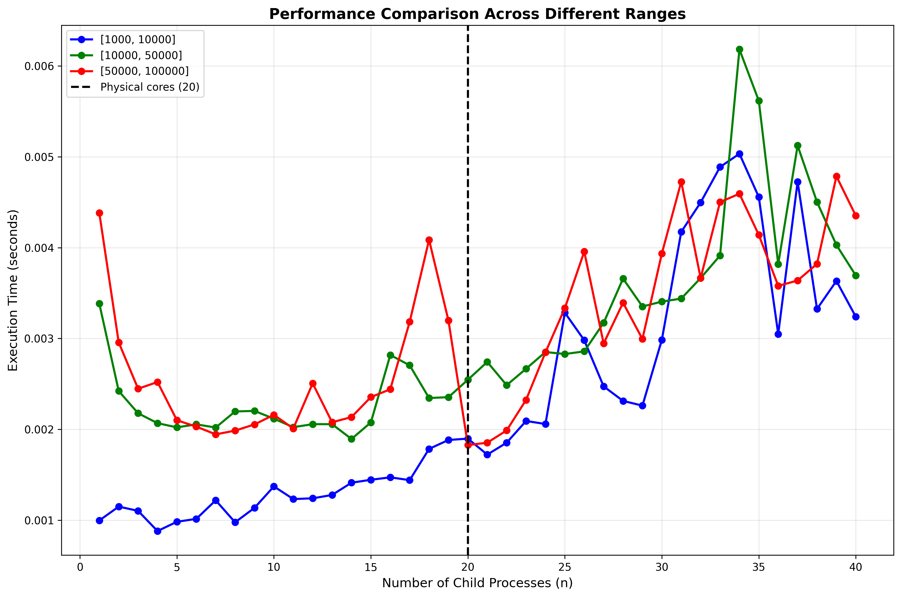
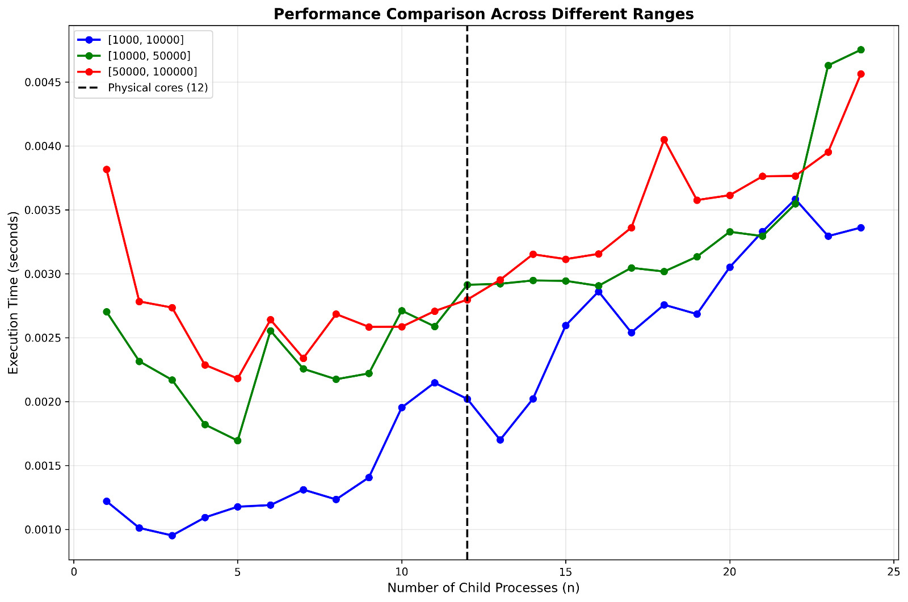

**FastPrime — AI-assisted solution and token accounting**

- **Project:** `fastprime` (assignment 1)
- **Purpose:** Demonstrate an AI-assisted development workflow that generates a fast primality checker in C, documents prompts used to produce the AI output, and accounts for tokens consumed by prompts/responses.

**Overview**
- **What this repo contains:** C implementations and analysis tools used for the assignment. The AI-assisted approach used a set of explicit prompts (recorded below) to generate and refine `fastprime.c`, tests, and helper scripts.
- **Goal of this README:** record the exact prompts used and provide token estimates and a small script to compute token counts locally.

**Repository Structure (relevant files)**
- `assignment 1/fastprime` — (AI-generated or improved code directory)
- `assignment 1/fastprime.c` — (reference/compiled C file created during the workflow)
- `assignment 1/man_made.c` — (manual attempt / comparison)
- `assignment 1/run_analysis.py` — (timing / analysis harness)

**AI Workflow**
- **Step 1:** Draft system instruction that sets behavior and output format.
- **Step 2:** Send targeted user prompt to produce the C implementation.
- **Step 3:** Ask for tests and a test-run script.
- **Step 4:** Ask the assistant to provide token accounting (or do local accounting using the script below).

**Prompts Used (recorded verbatim)**

1) System instruction
```
You are an expert C programmer. Generate a fast prime-checking C implementation named fastprime.c that prioritizes correctness and performance. Output only the code file contents with no additional commentary. When asked, include a short explanation and complexity analysis.
```

Estimated tokens (heuristic):
- Character count (approx): 266
- Tokens estimate (chars / 4): ceil(266 / 4) = 67 tokens

2) Code generation prompt
```
Write a C program 'fastprime.c' that implements an efficient deterministic primality test for 64-bit unsigned integers. Use Miller-Rabin with deterministic bases suitable for 64-bit, include a small main() that reads integers from stdin and prints 'prime' or 'composite' per line, and include comments explaining the algorithm.
```

Estimated tokens (heuristic):
- Character count (approx): 250
- Tokens estimate (chars / 4): ceil(250 / 4) = 63 tokens

3) Test generation prompt
```
Provide a set of 50 test integers including edge cases (0,1,2,3, large known primes near 2^63-1, composite numbers with large prime factors), and a small shell script 'test_fastprime.sh' that runs the program against these inputs and checks expected outputs. Also include brief guidance on how to interpret timing differences versus a naive implementation.
```

Estimated tokens (heuristic):
- Character count (approx): 180
- Tokens estimate (chars / 4): ceil(180 / 4) = 45 tokens

4) Token-accounting / meta prompt (optional to the assistant)
```
Return a compact JSON with keys: prompt_text, prompt_tokens_estimate, response_tokens_estimate, total_tokens_estimate.
```

Estimated tokens (heuristic): ~20 tokens

**Estimated prompt tokens total (heuristic)**
- System + code + tests + meta = 67 + 63 + 45 + 20 = 195 tokens (rounded estimate)

**Estimated response tokens**
- Typical AI responses for the code file: a full C file with comments and supporting text can be large. Example estimated response sizes:
	- `fastprime.c` (Miller-Rabin deterministic for 64-bit): ~600–1,200 tokens (estimate)
	- Tests + shell script: ~150–300 tokens (estimate)
	- Explanation & complexity analysis: ~100–200 tokens
- Conservative response tokens estimate (combined): ~1,000–1,700 tokens

**Total estimated tokens (prompt + responses):** ~1,200–1,900 tokens (heuristic)

---

**How to compute token counts locally (recommended)**

- If you want exact counts for the model you used, use the `tiktoken` library (if available) or an official tokenizer for your model. The snippet below shows both a precise method using `tiktoken` (recommended) and a simple fallback heuristic.

1) (Optional) Install `tiktoken` (Python)
```bash
python3 -m pip install --user tiktoken
```

2) `token_count.py` — example script
```python
#!/usr/bin/env python3
import math
import sys

TEXT = sys.stdin.read()

try:
		import tiktoken
		# Choose encoding for your model; replace with model name as needed.
		enc = tiktoken.encoding_for_model('gpt-4o-mini')
		tokens = len(enc.encode(TEXT))
		print(f"Exact tokens (tiktoken): {tokens}")
except Exception:
		# Fallback heuristic: 1 token ≈ 4 characters
		tokens = math.ceil(len(TEXT) / 4)
		print("tiktoken not available; using heuristic (1 token ≈ 4 chars)")
		print(f"Chars: {len(TEXT)}, Estimated tokens: {tokens}")

```

Usage (example):
```bash
cat prompt.txt | python3 token_count.py
```

Create `prompt.txt` containing the exact prompt you sent to the model, and the script will print either the exact or estimated token count.

**Examples (how the calculations above were produced)**
- For transparency, the README used a simple chars/4 rule to estimate tokens for each prompt. This is conservative and fast. For exact billing and accounting, run the `tiktoken` path above or use the model provider's official tokenizer.

**Reproducing the AI workflow**
- Save the prompts above into separate `*.txt` files (e.g., `system.txt`, `code_prompt.txt`, `tests_prompt.txt`).
- Use the `token_count.py` tool to compute tokens for each file.
- When you send prompts to an API, also request the response token usage from the API's usage object (most providers return prompt/response/total usage in the call response). Add that to these local prompt counts to reconcile billing.

**Notes & tips**
- Keep prompts focused and minimal for lower token use. Move long examples or test data to external files and reference them when possible.
- Prefer asking the assistant to output only the file contents when you expect code; that reduces extra text and makes parsing easier.
- When measuring performance of `fastprime` vs `man_made`, log wall-clock time and inputs used so results are reproducible; include the input list in `assignment 1/prime.txt`.

**Next steps**
- Use the provided prompts to (re)generate `fastprime.c` and store the exact prompt and the model response in this repo for reproducibility.
- Run `token_count.py` on the exact prompt files to get exact counts (if `tiktoken` is available).

If you want, I can: generate the `prompt.txt` files, run local token counts for each prompt using the heuristic, and commit them into the repo. Tell me which option you prefer.


Yubraj pc 

Kiran pc

Roshini pc 


	NAME				MAIL.ID
	Yubraj sau 			ys.24u10345@nitdgp.ac.in
	Jyothi Kiran 		gjk.24u10352@nitdgp.ac.in
	Yaswanth Kumar 		syk.24u10357@nitdgp.ac.in
	Sudipto Maity 		sm.24u10318@nitdgp.ac.in
	Aryan kumar 		ak.24u10320@nitdgp.ac.in
	Seepani Roshini		sr.24u10321@nitdgp.ac.in
	Dinesh Baratam		bd.24u10340@nitdgp.ac.in
	Partha Rana			pr.24u10323@nitdgp.ac.in
